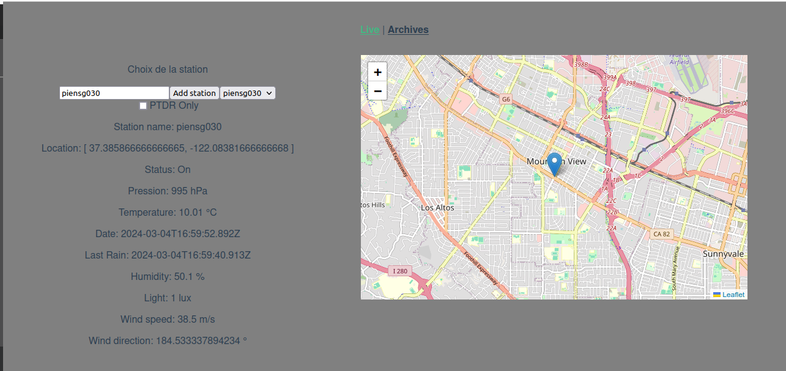
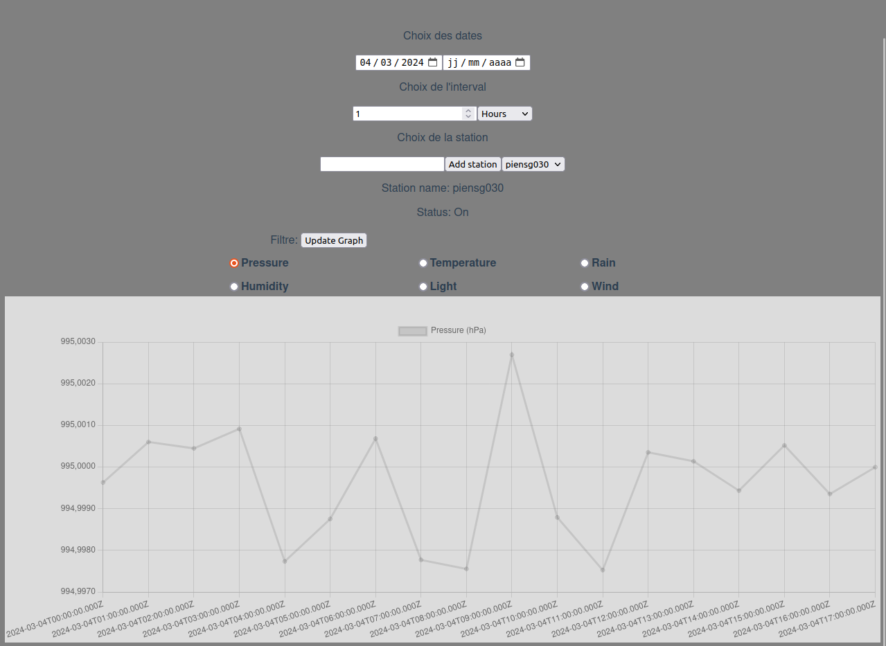

# Station météo Front End




## Description

Application permettant de récupérer via des API, des données météos.

## Installation

```
npm install
```

#### Compiles and hot-reloads for development

```
npm run serve
```

#### Compiles and minifies for production

```
npm run build
```

## Notice d'utilisation

### Live

1. Ouvrez la page "Live"
2. Entrez le nom de domaine de la station (par exemple, "piensg030") dans le champ prévu à cet effet ou sélectionner une station déjà ajoutée
3. Cliquez sur le bouton "Add Station"
4. Les dernières données disponibles de la station seront récupérées et affichées

### Archive

1. Ouvrez la page "Archive"
2. Choisissez une date de départ (nécessaire) et de fin (optionnel)
3. Choisissez un interval (optionnel)
4. Entrez le nom de domaine de la station (par exemple, "piensg030") dans le champ prévu à cet effet ou sélectionner une station déjà ajoutée
5. Cliquez sur le bouton "Add Station"
6. Choisissez une des données disponibles
7. Cliquez sur "Update Graph"
8. Les valeurs sont affichées sous forme de graphe
